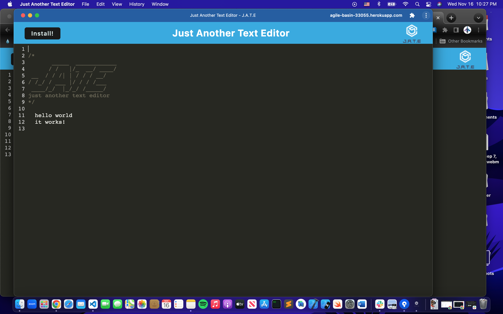
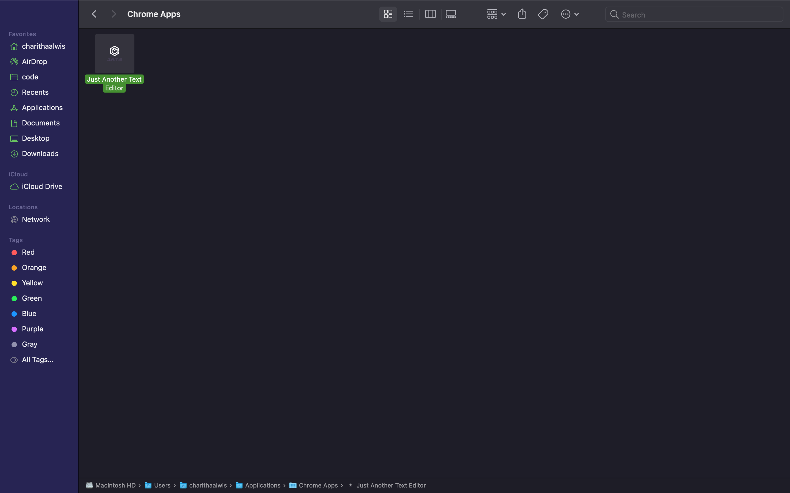
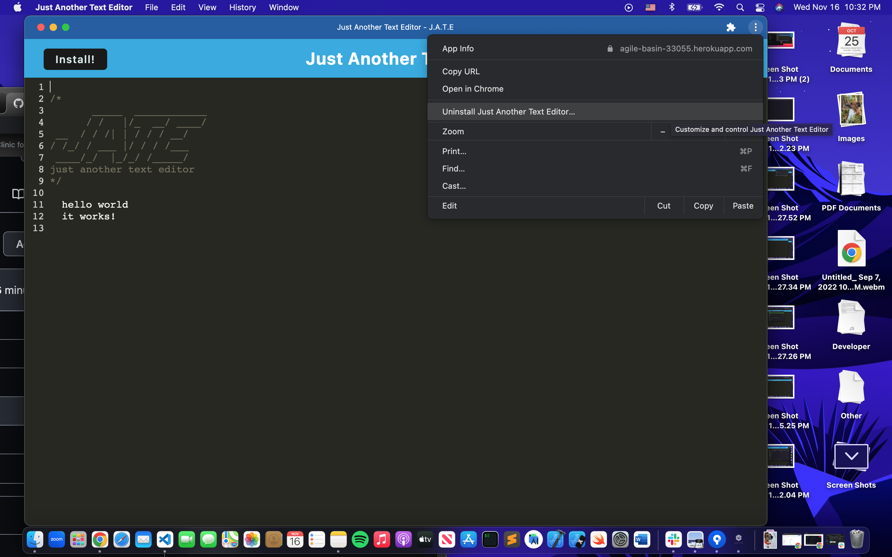
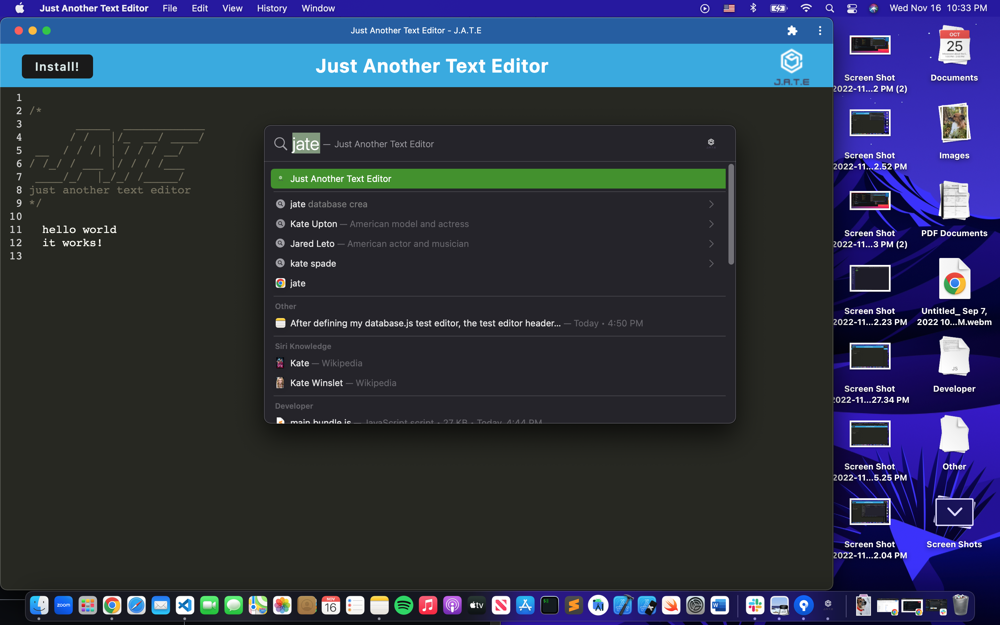
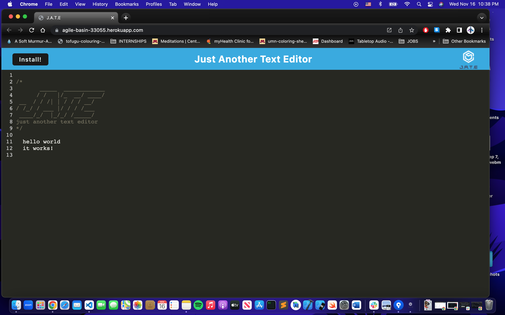
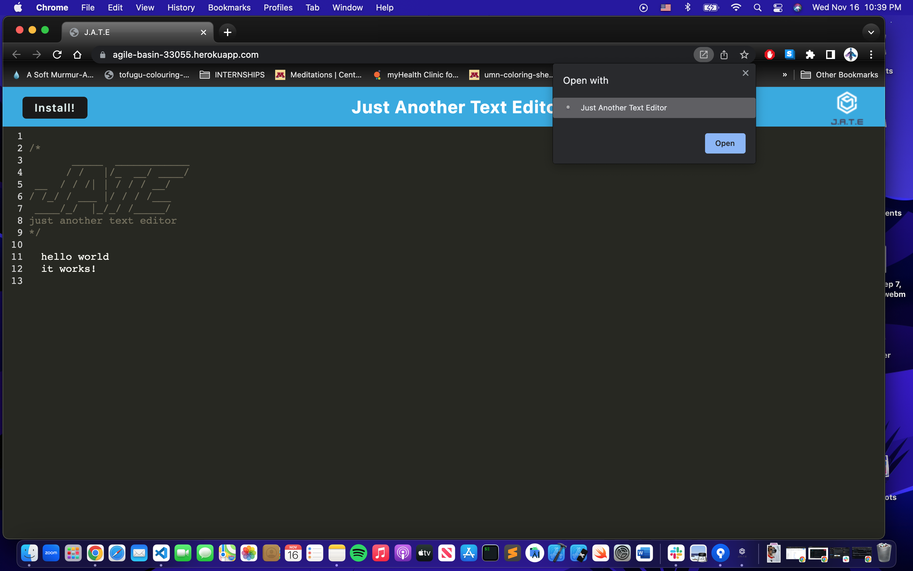
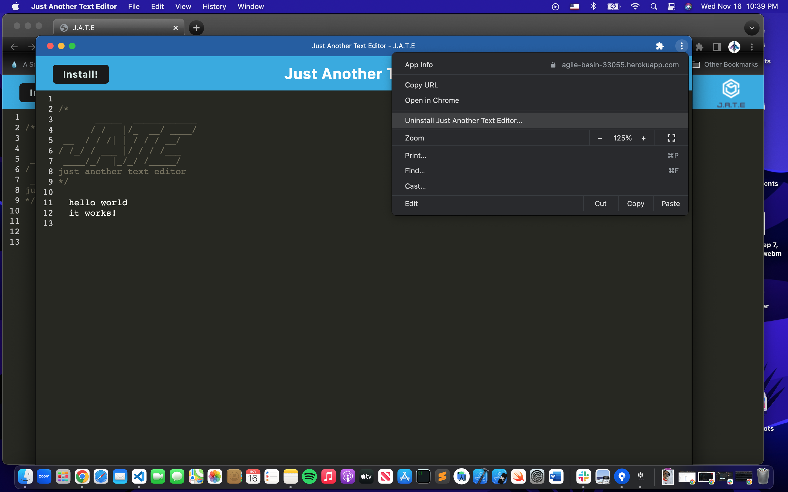

# mod 19 pwa text editor

  [](https://lbesson.mit-license.org/)

  ## Table of Contents
  * [Description](#description)
  * [Installation](#installation)
  * [Usage](#usage)
  * [Contributing](#contributing)
  * [Tests](#tests)
  * [Application](#Application)
  * [Screenshots](#Screenshots)
  * [Github](#github)
  * [Email Address](#email)
  * [Licenses](#licenses)

  
  ## Description
  this is a text editor app that runs in the browser, you can add and edit your notes and if you quit out of the application your notes will still be saved. you can also download the application to your computer to use this notetaker offline

  ## Installation
  use the heroku link and start from there to use the text editor or click on the install button to install the app to your desktop

  ## Usage
  type your notes into the page and the app will save your notes online or offline
  ## Licenses
  This project is covered under the MIT license. Please click on the license button to get more info.
  
  ## Contributing
  add things as needed
  
  ## Tests
  N/A
  
  ## Application
  ```
  https://agile-basin-33055.herokuapp.com/
 
 ```
 ## Application
 ## Screenshot
 







  
  ## Github
  Have questions about this project?  
  GitHub: https://github.com/DalPenny  
  Email: dalpenny@github.io.com

